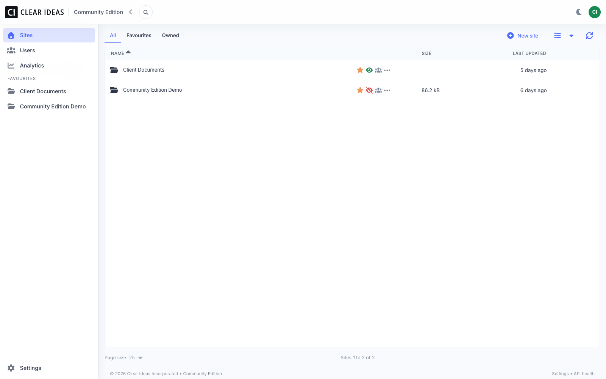
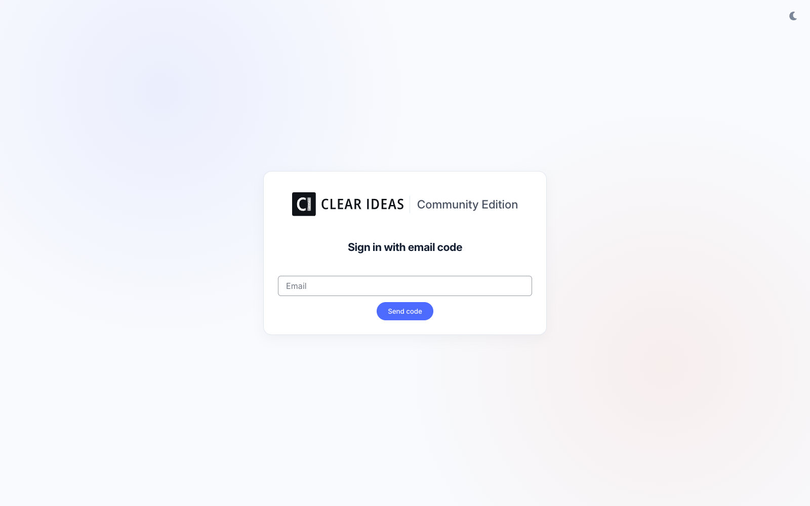
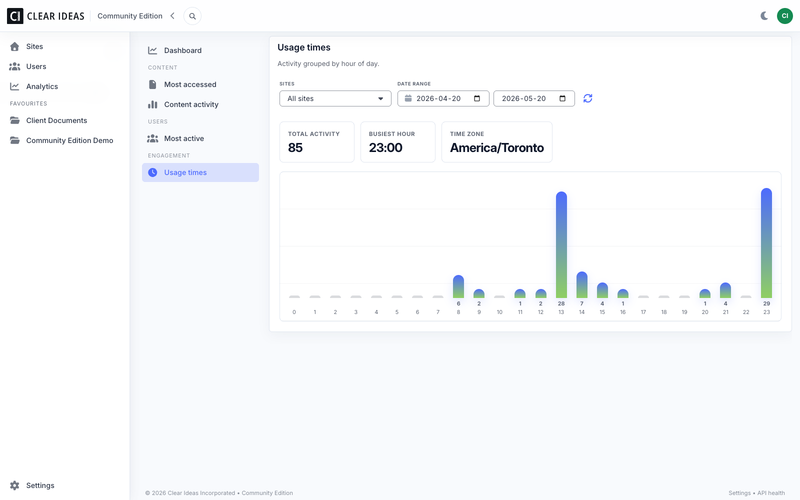
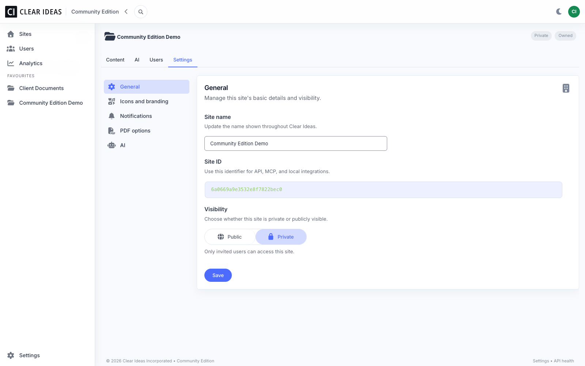
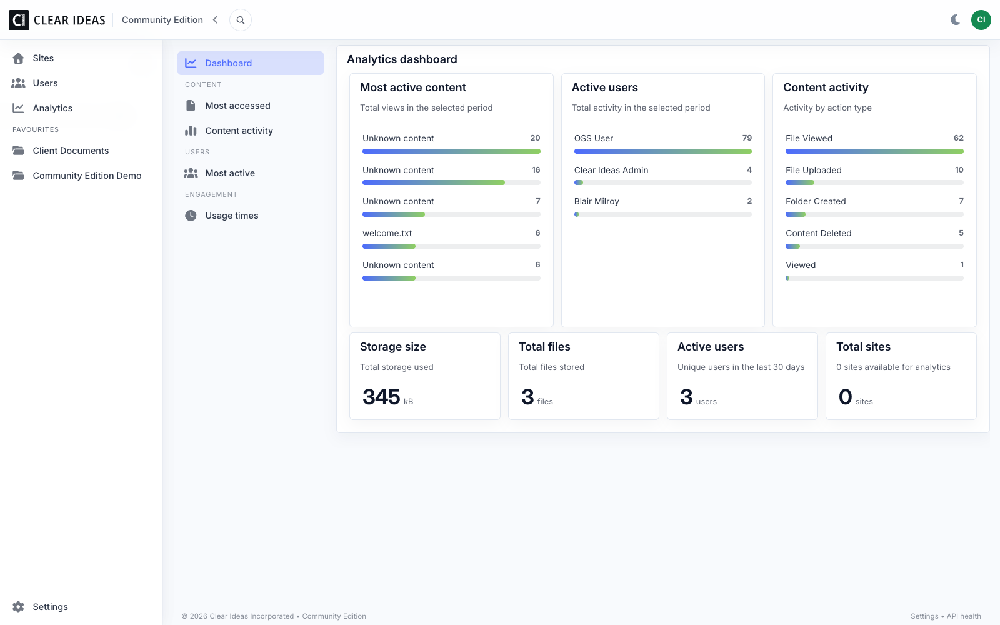
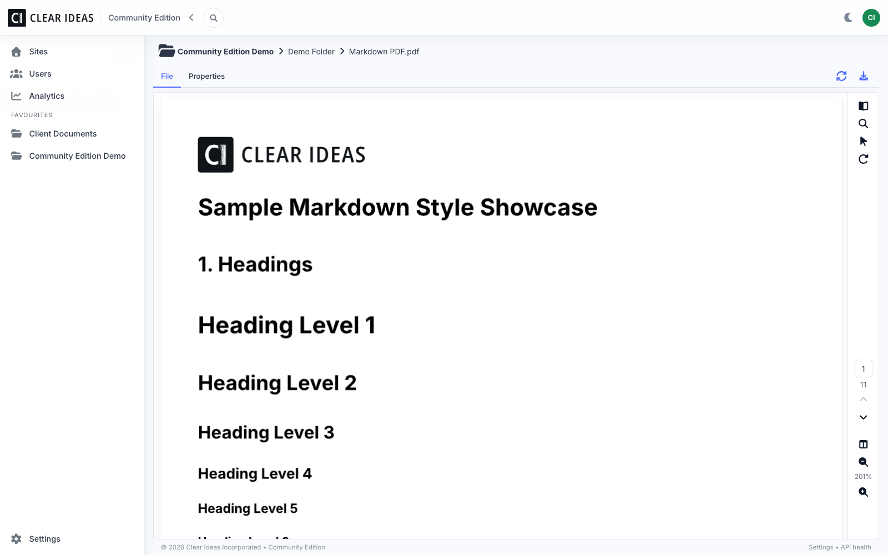

# Clear Ideas Community Edition

Self-hosted secure file sharing and AI-ready collaboration for professional teams.

Clear Ideas Community Edition is a lightweight, open-source virtual data room (VDR) and AI-ready collaboration workspace for teams that want to inspect, run, and own the foundation of their collaboration layer. It includes site-based file sharing, access control, search, activity logging, scheduled email notifications, Model Context Protocol (MCP) tools, and optional site-scoped AI chat.

The app is a single server: API routes live under `/api`, and the Vue web app is served by the same process.

Learn more about Clear Ideas at [clearideas.com](https://clearideas.com/). For hosted plans, advanced governance, document signing, AI workflows, and managed deployment options, see [Clear Ideas Pricing](https://clearideas.com/pricing) or [contact sales](https://clearideas.com/contact/sales).

## Run In 5 Minutes

Clone the repo and start a complete local stack with HTTPS, app, MongoDB, and Mailpit email capture:

```bash
git clone https://github.com/clearideas/clearideas-ce.git
cd clearideas-ce
docker compose -f docker-compose.yml -f docker-compose.quickstart.yml up -d --build
```

Open `https://localhost:4100`. Open Mailpit at `http://localhost:8025` to read sign-in codes and invites.

The quick-start stack uses local development secrets and creates the first owner as `admin@example.com`. For anything beyond a local trial, copy `.env.example` to `.env`, set real secrets, and use the production-shaped Compose options below.

## Screenshots

### Email-Code Sign In



### Sites



### File Viewer



### Site AI



### Site Settings



### Analytics



## Features

- Passwordless email-code authentication
- Users, groups, site roles, and invitations
- Sites, nested folders, uploads, downloads, and file viewing
- Local disk storage provider
- Metadata search and local full-text search with MiniSearch
- PDF text extraction for searchable/retrievable PDF text
- Activity logging and simple analytics reports
- Log or SMTP email delivery
- Scheduled notification worker with per-site/user preferences and digest emails
- Model Context Protocol (MCP) endpoint with scoped access keys for external tools and AI clients
- Optional non-persisted site AI chat using your configured provider and site content
- Optional bundled operator documentation at `/docs`
- HTTPS enforcement, CSRF protection, file access tokens, and configurable API rate limiting

## Community Edition Scope

### What It Is

Community Edition is intended for teams that want a self-hosted, inspectable Clear Ideas deployment for secure collaboration and AI-ready document workflows:

- Upload, organize, preview, search, and download files in site-based workspaces.
- Invite users, assign site roles, and keep activity records for common collaboration events.
- Run local storage and search indexing without a managed cloud dependency.
- Optionally connect your own AI provider keys for non-persisted site chat over approved site content.
- Use scoped Model Context Protocol (MCP) access keys for permitted external AI/client integrations.

### What It Is Not

Community Edition is not the full hosted Clear Ideas platform. It does not include managed hosting, commercial support, advanced governance controls, document signing, AI workflow automation, organization policy controls, or enterprise identity features.

For those capabilities, use hosted Clear Ideas. See [clearideas.com](https://clearideas.com/) and [Clear Ideas Security & Trust](https://clearideas.com/security).

## Community Edition vs Hosted Clear Ideas

| Capability | Community Edition | Hosted Clear Ideas |
| --- | --- | --- |
| Self-hosted deployment | Yes | No |
| Managed hosting | No | Yes |
| Site-based file sharing | Core workflows | Full product experience |
| External collaboration | Basic | Team/client-ready |
| Search and file preview | Local search and previews | Managed and expanded |
| AI chat | Bring your own provider key | Included/managed by plan |
| Repeatable AI workflows | Not included | First-class hosted capability |
| Document signing | Not included | Available in hosted editions |
| Admin and policy controls | Basic | Advanced |
| Support | Community | Product support |
| Best for | Evaluation, self-hosters, internal use | Professional teams working with clients |

## Quick Start

Clear Ideas runs as one app container behind a Caddy HTTPS proxy. The bundled Caddyfile is configured for local HTTPS with Caddy's internal certificate authority. For a public domain, use your own reverse proxy/TLS setup or change the Caddyfile to use public ACME certificates before exposing the app.

### 1. Create Your Env File

```bash
cp .env.example .env
```

Edit `.env` and set at least:

```env
APP_URL=https://localhost:4100
BETTER_AUTH_URL=https://localhost:4100
CADDY_SITE=https://localhost:4100
BETTER_AUTH_SECRET=replace-with-a-long-random-secret
FILE_ACCESS_TOKEN_SECRET=replace-with-another-long-random-secret
FIRST_USER_EMAIL=you@example.com
FIRST_USER_NAME=Your Name
EMAIL_PROVIDER=smtp
EMAIL_FROM="Clear Ideas <noreply@example.com>"
SMTP_HOST=smtp.example.com
SMTP_PORT=587
SMTP_SECURE=false
SMTP_USER=smtp-user
SMTP_PASS=smtp-password
```

For MongoDB, choose one option:

```env
# Option A: one MongoDB connection string
MONGODB_URI=mongodb://mongo.example.com:27017/clearideas_ce

# Option B: split hosted MongoDB/Atlas-style settings
MONGODB_HOST=
MONGODB_DATABASE_NAME=clearideas_ce
MONGODB_AUTH_MECHANISM=
MONGODB_USERNAME=
MONGODB_PASSWORD=
MONGODB_CERTIFICATE_BASE64=
```

If you use the local Mongo Compose override below, you can leave all MongoDB variables blank. The override supplies the container-to-container MongoDB URL.

### 2. Start With Your Existing MongoDB

Use this when `.env` contains `MONGODB_URI` or the split MongoDB variables:

```bash
docker compose --env-file .env up -d --build
```

### 3. Or Start With Local MongoDB Too

Use this for a complete local stack with app, HTTPS proxy, and MongoDB:

```bash
docker compose --env-file .env \
  -f docker-compose.yml \
  -f docker-compose.local-mongo.yml \
  up -d --build
```

### 4. Open The App

```text
https://localhost:4100
```

Compose starts the app and a Caddy HTTPS proxy. The bundled Caddyfile uses an internal certificate authority for local HTTPS, so your browser may show a certificate warning unless you trust Caddy's local CA.

If port `4100` is already in use, set `CLEARIDEAS_CE_HOST_PORT`, `APP_URL`, `BETTER_AUTH_URL`, and `CADDY_SITE` to another local port, for example `https://localhost:4110`.

The app creates `FIRST_USER_EMAIL` as the first owner before the server starts. The bootstrap is idempotent, so restarts do not duplicate the user.

### Local Development Email

For development without real SMTP, add the Mailpit override:

```bash
docker compose --env-file .env \
  -f docker-compose.yml \
  -f docker-compose.local-mongo.yml \
  -f docker-compose.dev.yml \
  up -d --build
```

Open Mailpit at `http://localhost:8025` to read sign-in codes and invites.

Mailpit is intended for development only. For production-shaped startup, configure a real SMTP provider in `.env`.

## Update An Existing Deployment

The app code is packaged into the Docker image. MongoDB data, uploaded files, and search indexes live outside the image in MongoDB and Docker volumes, so a normal software update rebuilds/recreates the app container without deleting data.

Before updating, take a backup of MongoDB and uploaded file storage. Then fetch the latest release or pull the latest repo changes, keep your existing `.env`, and run the same Compose command you used to start the deployment.

For the quick-start stack:

```bash
git pull
docker compose -f docker-compose.yml -f docker-compose.quickstart.yml up -d --build
```

For a production-shaped `.env` deployment with local MongoDB:

```bash
git pull
docker compose --env-file .env \
  -f docker-compose.yml \
  -f docker-compose.local-mongo.yml \
  up -d --build
```

For an external MongoDB deployment:

```bash
git pull
docker compose --env-file .env up -d --build
```

Do not run `docker compose down -v` during an update unless you intentionally want to delete named volumes. Plain `up -d --build` preserves volumes and replaces only containers/images as needed.

## Local Development

```bash
npm install
npm run build:core
npm run bootstrap:ce
npm run dev:ce
```

Useful commands:

```bash
npm run build:ce
npm run type-check:ce
npm run test:ce
npm run test:ce:e2e
npm run bootstrap:ce
npm run seed:ce
npm run smoke:ce
```

## Environment

Copy `.env.example` and set values for your install.

Minimum production-style setup:

```env
APP_URL=https://clearideas.example.com
BETTER_AUTH_URL=https://clearideas.example.com
BETTER_AUTH_SECRET=change-me-to-a-long-random-secret
FILE_ACCESS_TOKEN_SECRET=change-me-to-another-long-random-secret
MONGODB_URI=mongodb://mongo.example.com:27017/clearideas_ce
HTTPS_REQUIRED=true
EMAIL_PROVIDER=smtp
EMAIL_FROM="Clear Ideas <noreply@example.com>"
SMTP_HOST=smtp.example.com
SMTP_PORT=587
SMTP_SECURE=false
SMTP_USER=smtp-user
SMTP_PASS=smtp-password
FIRST_USER_EMAIL=you@example.com
FIRST_USER_NAME=Your Name
```

Production requires a reverse proxy or load balancer that terminates HTTPS and forwards `X-Forwarded-Proto=https`, plus a strong auth secret, MongoDB, and SMTP. If you use the bundled Caddy service for a real domain, remove `tls internal` from `Caddyfile` and configure DNS so Caddy can issue a browser-trusted certificate.

### Rate Limiting

Community Edition includes built-in Express rate limiting. Defaults are conservative for small self-hosted deployments and can be tuned with environment variables:

| Variable | Default |
| --- | ---: |
| `CLEARIDEAS_API_RATE_LIMIT_WINDOW_MS` | `900000` |
| `CLEARIDEAS_API_RATE_LIMIT_LIMIT` | `600` |
| `CLEARIDEAS_AUTH_RATE_LIMIT_WINDOW_MS` | `900000` |
| `CLEARIDEAS_AUTH_RATE_LIMIT_LIMIT` | `60` |
| `CLEARIDEAS_SPA_RATE_LIMIT_WINDOW_MS` | `300000` |
| `CLEARIDEAS_SPA_RATE_LIMIT_LIMIT` | `300` |
| `CLEARIDEAS_CORE_RATE_LIMIT_WINDOW_MS` | `900000` |
| `CLEARIDEAS_CORE_RATE_LIMIT_LIMIT` | `600` |
| `CLEARIDEAS_CHAT_RATE_LIMIT_WINDOW_MS` | `900000` |
| `CLEARIDEAS_CHAT_RATE_LIMIT_LIMIT` | `120` |
| `CLEARIDEAS_ANALYTICS_RATE_LIMIT_WINDOW_MS` | `900000` |
| `CLEARIDEAS_ANALYTICS_RATE_LIMIT_LIMIT` | `300` |
| `CLEARIDEAS_ACTIVITY_RATE_LIMIT_WINDOW_MS` | `900000` |
| `CLEARIDEAS_ACTIVITY_RATE_LIMIT_LIMIT` | `600` |

If you place the app behind a proxy, keep `X-Forwarded-For` forwarding intact so per-client limits are meaningful.

### Bundled Operator Docs

Community Edition includes technical setup and operator documentation at `/docs`. Hide these docs from the app menu and block direct `/docs` access with:

```env
CLEARIDEAS_DOCS_ENABLED=false
```

## Model Context Protocol (MCP) Example

```bash
curl -X POST https://localhost:4100/api/mcp \
  -H "Authorization: Bearer $CLEAR_IDEAS_MCP_KEY" \
  -H "Content-Type: application/json" \
  -d '{"tool":"clearideas.list_sites","args":{}}'
```

MCP access keys let approved external tools call scoped Clear Ideas operations, such as listing permitted sites or searching content, without sharing a browser session.

## AI Configuration

AI chat is optional and disabled unless a model is configured. When enabled, Community Edition can answer site-scoped questions using your configured provider and the local Clear Ideas MCP tools. Chat responses are not persisted.

```env
AI_CHAT_MODEL=openai:gpt-4.1-mini
AI_CHAT_MODELS=openai:gpt-4.1-mini
OPENAI_API_KEY=<key>
```

## Operations

- Back up MongoDB, `STORAGE_ROOT`, and `SEARCH_INDEX_ROOT` together.
- Use SMTP for production email; use Mailpit only for local development.
- Keep `HTTPS_REQUIRED=true` for any public deployment.
- Use long random values for `BETTER_AUTH_SECRET` and `FILE_ACCESS_TOKEN_SECRET`.
- Tune rate limits for your proxy, expected traffic, and user count.
- Run `npm run check:ce-release` before publishing or distributing a modified build.

## Roadmap

Community Edition is intentionally focused. Likely follow-up areas:

- More import/export and backup guidance.
- More granular notification controls.
- Additional Model Context Protocol (MCP) tools for common file operations.
- More searchable file types.
- Hardening docs for public internet deployments.

Hosted Clear Ideas will continue to carry the broader product roadmap for managed collaboration, governed AI workflows, signing, business process automation, and organization controls.

## Limitations

Community Edition focuses on core self-hosted secure collaboration workflows. Hosted Clear Ideas editions may include managed infrastructure, commercial support, advanced governance, organization policy controls, document signing, workflow automation, enterprise identity, and additional security features.

For commercial deployment questions, visit [clearideas.com](https://clearideas.com/), review [pricing](https://clearideas.com/pricing), or contact the [Clear Ideas Support Center](https://clearideas.com/support).

## Getting Help

- For security issues, see `SECURITY.md`.
- For contributions, see `CONTRIBUTING.md`.
- For hosted Clear Ideas questions, visit [clearideas.com/contact](https://clearideas.com/contact).

## License

Clear Ideas Community Edition is licensed under the GNU Affero General Public License v3.0. See `LICENSE`.
